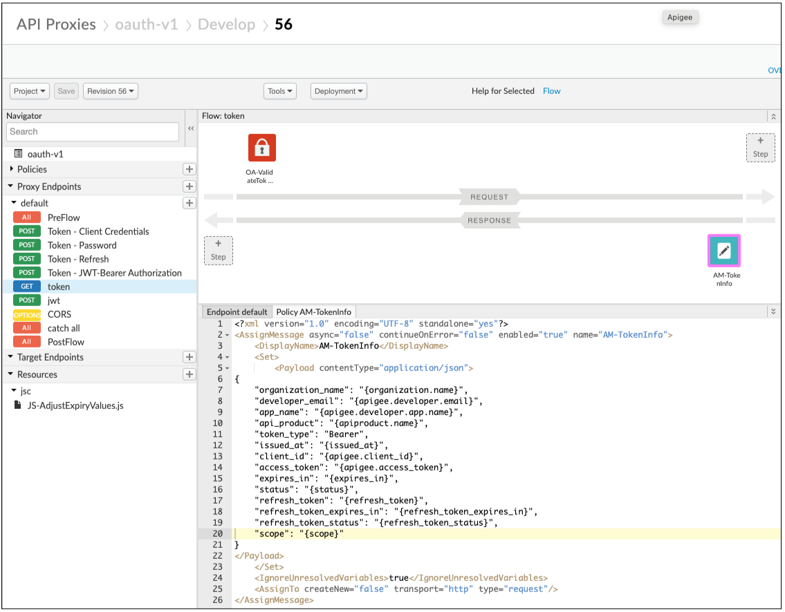
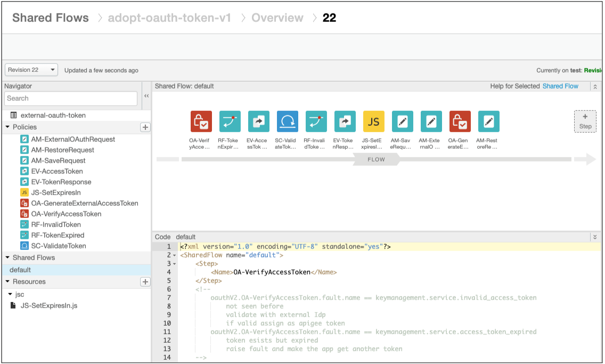
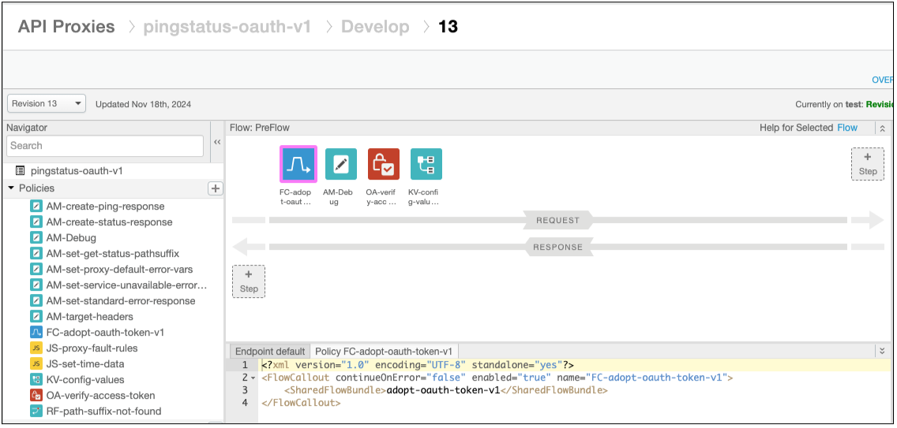
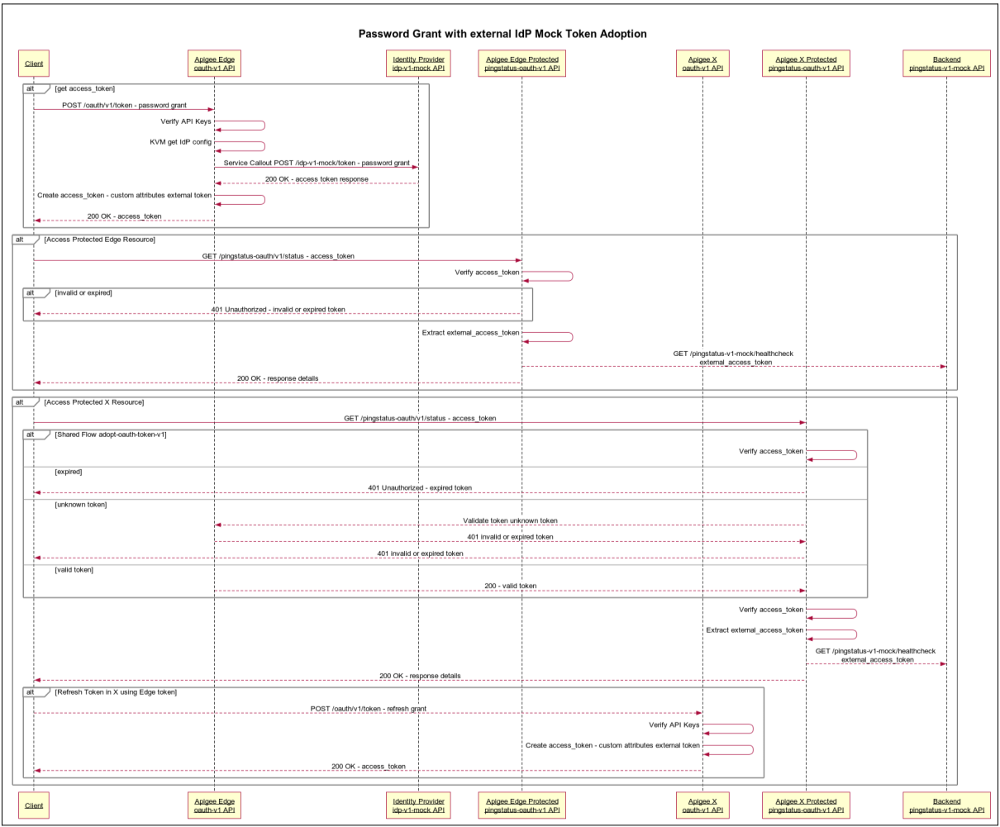

# Ping and Status OAuth protected resources with Edge to X token capture

This example demonstrates the ability for an Apigee X to capture and "adopt" Apigee Edge OAuth tokens and refresh tokens.

The pingstatus-oauth-v1 proxy used in [OAuth V2 Proxy for Client Credentials and Password Grant Types](https://github.com/kurtkanaskie/oauth-demo-mock-idp-protected-resource) 
example is modified here to use the Shared Flow [adopt-oauth-token-v1](./adopt-oauth-token-v1/README.md).

## Use Case
As an Apigee Edge API platform owner migrating APIs from Edge to X,\
I need to import OAuth access and refresh tokens from Edge into X,\
So that I can “adopt” Edge tokens as valid X tokens and not require Apps to generate new tokens.


## References
[OAuthV2 policy | Apigee | Google Cloud](https://cloud.google.com/apigee/docs/api-platform/reference/policies/oauthv2-policy#externalaccesstoken-element) - External Access Token\
[Using third-party OAuth tokens | Apigee | Google Cloud](https://cloud.google.com/apigee/docs/api-platform/security/oauth/use-third-party-oauth-system)

## Prerequisites
Apigee Edge
* Apigee Edge OAuth proxy - existing solution
* Apigee Edge Proxies, API Products, Developers, Apps and credentials migrated to X
  * see [apigee-migrate-edge-to-x-tools](https://github.com/kurtkanaskie/apigee-migrate-edge-to-x-tools) repo for help

Apigee X - see [OAuth V2 Proxy for Client Credentials and Password Grant Types](https://github.com/kurtkanaskie/oauth-demo-mock-idp-protected-resource) 
* Apigee X OAuth proxy
* Apigee X proxy protected by OAuth

## Solution Architecture
### Overview
Modify the existing Edge OAuth proxy to have a GET /token endpoint that validates a token and returns token details.
- OAuth policy with operation VerifyAccessToken
- Assign Message policy to return access_token, refresh_token and expiry values 

Create a Shared Flow (zip file here: adopt-oauth-token-v1)
- OAuth policy with operation VerifyAccessToken to validate the incoming token from Edge
- If token exists but expired Raise Fault access_token_expired
- If token is invalid Extract Variables to get access_token from request
- If token is invalid Service Callout to Edge OAuth proxy to validate the token
- If not valid Raise Fault invalid_access_token
- If valid Extract Variables to get access_token, refresh_token and expiry values
- JavaScript policy to set expiry values in milliseconds
- Assign Message to save original request
- Assign Message to create OAuth request
- OAuth policy with operation GenerateAccessToken to adopt token
- Assign Message to restore original request

Modify the OAuth protected proxy to use a Shared Flow callout prior to the OAuth VerifyAccessToken policy.

### Build and Deploy
You know the drill, modify the pom.xml files with your Apigee X details.

####  All at once
Create proxy, configuration items, API products and app in one step
```
export PROFILE=test
mvn -P $PROFILE -Dapigee.bearer=$(gcloud auth print-access-token) install
```

### Solution Details
#### Edge OAuth proxy GET /token endpoint


OA-ValidateToken
```
<?xml version="1.0" encoding="UTF-8" standalone="yes"?>
<OAuthV2 async="false" continueOnError="false" enabled="true" name="OA-ValidateToken">
    <DisplayName>OA-ValidateToken</DisplayName>
    <Operation>VerifyAccessToken</Operation>
</OAuthV2>
```

AM-TokenInfo
```
<?xml version="1.0" encoding="UTF-8" standalone="yes"?>
<AssignMessage async="false" continueOnError="false" enabled="true" name="AM-TokenInfo">
    <DisplayName>AM-TokenInfo</DisplayName>
    <Set>
        <Payload contentType="application/json">
{
    "organization_name": "{organization.name}",
    "developer_email": "{apigee.developer.email}",
    "app_name": "{apigee.developer.app.name}",
    "api_product": "{apiproduct.name}",
    "token_type": "Bearer",
    "issued_at": "{issued_at}",
    "client_id": "{apigee.client_id}",
    "access_token": "{apigee.access_token}",
    "expires_in": "{expires_in}",
    "status": "{status}",
    "refresh_token": "{refresh_token}",
    "refresh_token_expires_in": "{refresh_token_expires_in}",
    "refresh_token_status": "{refresh_token_status}",
    "scope": "{scope}"
}
</Payload>
    </Set>
    <IgnoreUnresolvedVariables>true</IgnoreUnresolvedVariables>
    <AssignTo createNew="false" transport="http" type="request"/>
</AssignMessage>
```

#### Apigee X Shared Flow - adopt-oauth-token-v1


#### Apigee X protected Proxy


Testing
High level API flow

- curl -X POST $EDGE_HOST/oauth/v1/token (password grant) - get Edge tokens
- curl $EDGE_HOST/pingstatus/v1/ping (protected proxy) - uses Edge tokens
- curl $X_HOST/pingstatus/v1/ping (migrated protected proxy with adopt-oauth-token-v1 shared flow) - adopts Edge access and refresh tokens
- curl $X_HOST/pingstatus/v1/ping (migrated protected proxy with adopt-oauth-token-v1 shared flow) - uses adopted access token
- curl $X_HOST/oauth/v1/token (refresh_token grant) - gets new tokens using adopted refresh token

Sequence Diagram



## Disclaimer
This example is not an official Google product, nor is it part of an official Google product.

## License
This material is copyright 2019, Google LLC. and is licensed under the Apache 2.0 license. See the [LICENSE](LICENSE) file included.

This code is open source.
